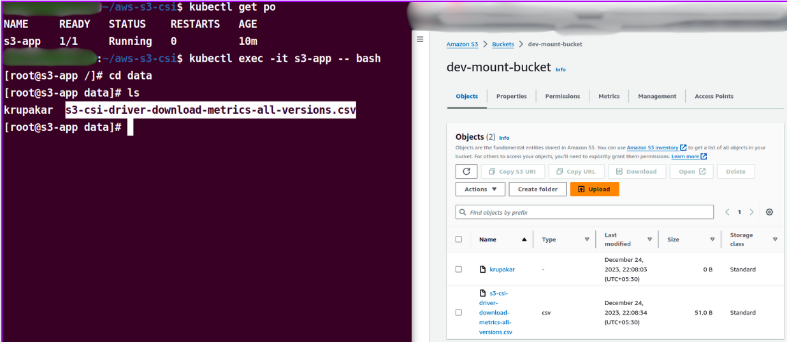

# Amazon S3 CSI Driver Provisioning using Terraform
### This repo consists of terraform files that provisions S3 Driver in EKS cluster

Amazon S3 Driver is a software component that acts like a translator or bridge between the eks and S3. This driver is a static provisioning storage system, it mean mount pre-existing buckets to the pods as persisitant volumes.
The driver acts like an interface between eks and s3. 

This repo. creates an IAM Role with assume role policy for OIDC provider along with S3 Bucket Policy. 

## How to use this module to install S3 CSI Driver

First require an IAM OIDC provider must exist for your cluster's OIDC issuer URL, to use AWS Identity and Access Management (IAM) roles for service accounts.

Create an OIDC provider for you cluster:

```sh
eksctl utils associate-iam-oidc-provider --cluster $cluster_name --approve
```
Replace cluster_name with your eks cluster name.

Then add below piece of code in your terraform configuration, and place your inputs such as  `region`, `aws_profile`,  `bucket_name`, `cluster_name` and give name for `Iam Role`. Here this role assigns with policy having s3 bucket permissions and role has assumeRole policy with eks cluster.

```sh
module "eks-s3-csi" {
  source           = "krupakar0307/s3-csi-driver/aws"
  version          = "0.0.2"
  aws_region       = "region"
  aws_profile      = "profile_name"
  bucket_name      = "bucket_name"
  iam_role_name    = "role_name"
  eks_cluster      = "cluster_name"
}
```
Apply `terraform init`, `terraform plan` and followed by `terraform apply`.

After applying, you will notice pods coming up in `kube-system` namespace. 
Then create your pv.yaml, pvc.yaml and pod.yaml files. mount s3 bucket in your pv configuration. 

you can take a reference of how to mount s3 bucket with in pod configuration from this [static-provisioning yaml](https://github.com/awslabs/mountpoint-s3-csi-driver/blob/main/examples/kubernetes/static_provisioning/static_provisioning.yaml)

Finally you can see the files which are available in your s3 bucket inside your pod on mounted path directory.

In the screenshot below, I used the mount S3 bucket in the data folder, and you can see two files available in the bucket, which is reflected in the pod's directory.




Thanks!